# Langflow

As Cluster Admin

## Installation 
```bash
helm repo add langflow https://langflow-ai.github.io/langflow-helm-charts
helm repo update

helm install langflow-ide langflow/langflow-ide --namespace langflow --create-namespace
```

```bash
oc project langflow
```

```bash
watch oc get pods 
```

```
NAME                                         READY   STATUS              RESTARTS   AGE
langflow-service-0                           0/1     ContainerCreating   0          18s
langflow-service-frontend-84dcb78879-rwrm6   1/1     Running             0          18s
```

```bash
oc get statefulset
NAME               READY   AGE
langflow-service   0/1     6m54s
```

Wait a bit before running the fix script

```bash
./fix-langflow-probes.sh
```

Create route for frontend

```bash
oc create route edge langflow-service --service=langflow-service -n langflow
```

And create a route for backend as that is helpful to Claude Code and provides better API access

```bash
oc create route edge langflow-backend-docs --service=langflow-service-backend --port=7860 -n langflow
```


```bash
export LANGFLOW_URL=https://$(oc get routes -l app=langflow-service -o jsonpath="{range .items[*]}{.status.ingress[0].host}{end}")
export LANGFLOW_DOCS_URL=https://$(oc get route langflow-backend-docs -n langflow -o jsonpath='{.spec.host}')
```

GUI

```bash
open $LANGFLOW_URL
```

Swagger/OpenAPI 

```bash
open $LANGFLOW_DOCS_URL/docs
```


### Optional: Claude Code 

Go into Settings, API Keys to give Claude Code access to Langflow

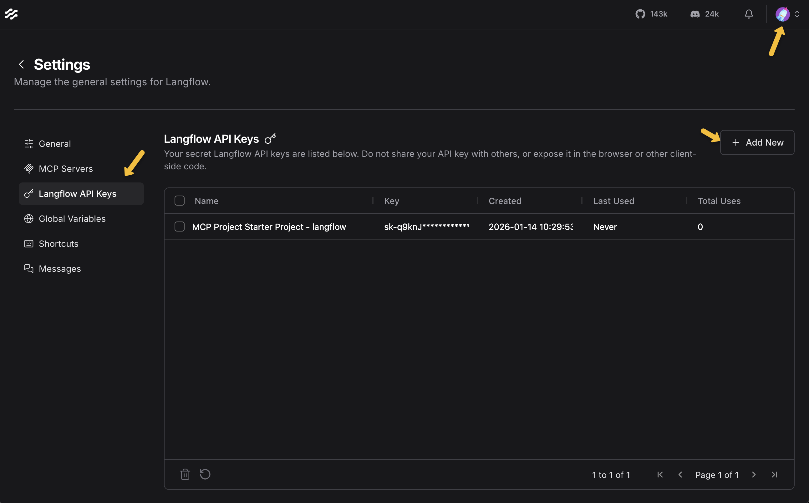

```bash
export LANGFLOW_API_KEY=sk-vkJtkTO6Rjveq2rLwZauICtpuSH_c1GgZyCAb52-D9k
```


## Hello World 

Open the URL in your browser


Create a new flow - Click "Create first flow"


Click "Blank Flow"


Drag a Text Input component onto the canvas


Drag a Chat Output component onto the canvas


Connect them together (drag from the output node to the input node)

    
  
Test it - Click the "Playground" button (bottom right) and type a message


Using this icon to get back to the list of all projects and flows


## vLLM 


  For an LLM-powered hello world:

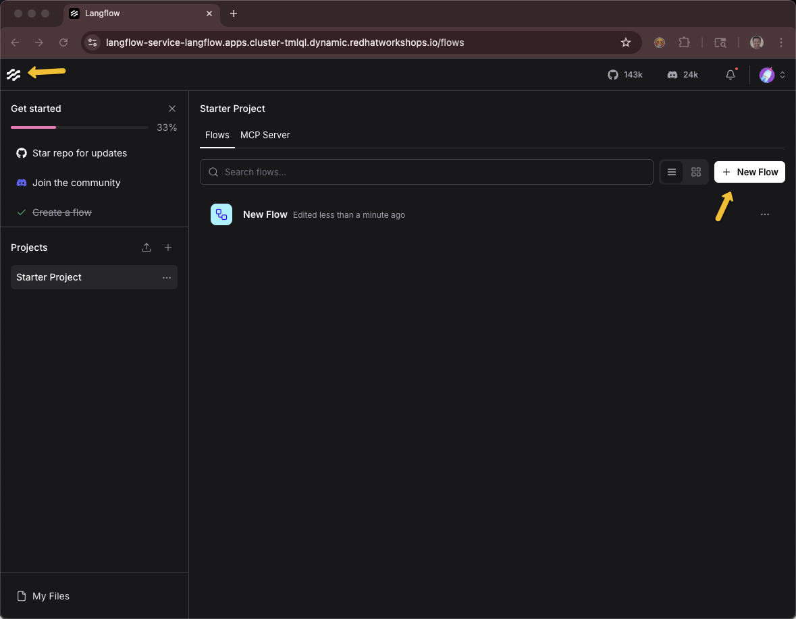

Basic Flow

  1. Add Chat Input component

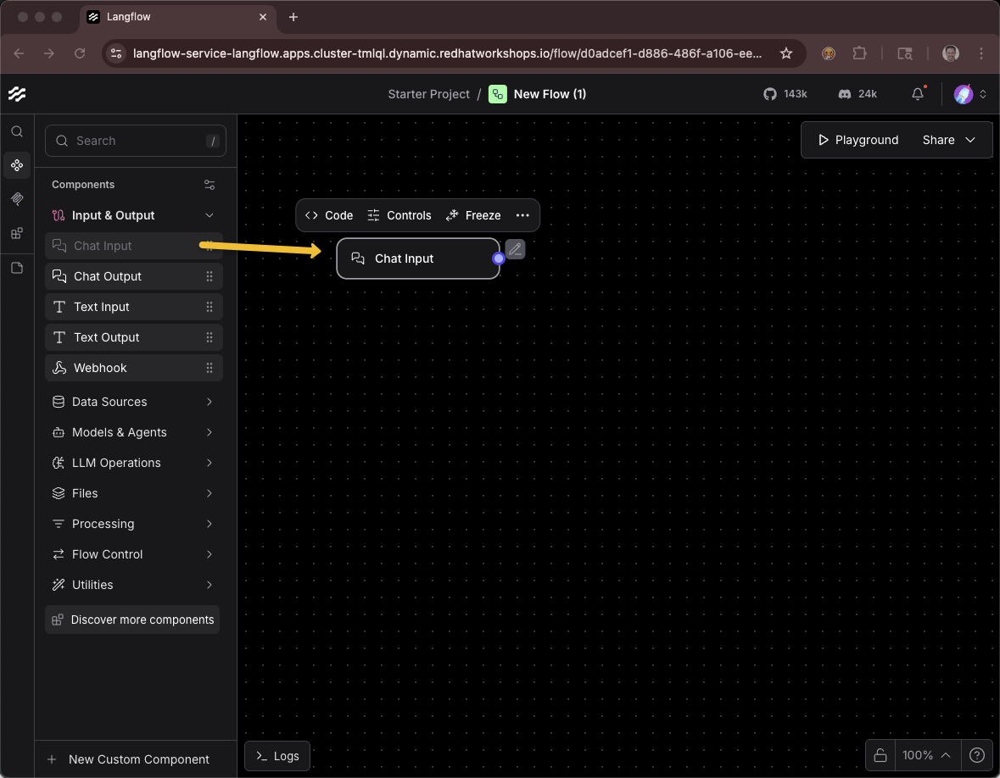

  2. Add Custom Component

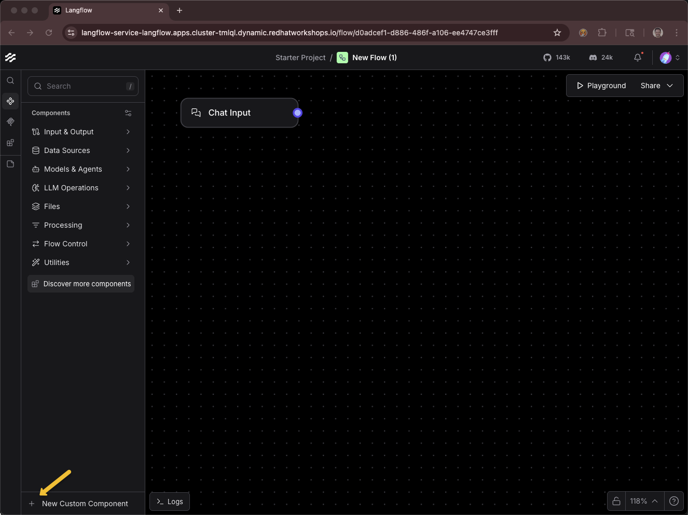

  3. Code

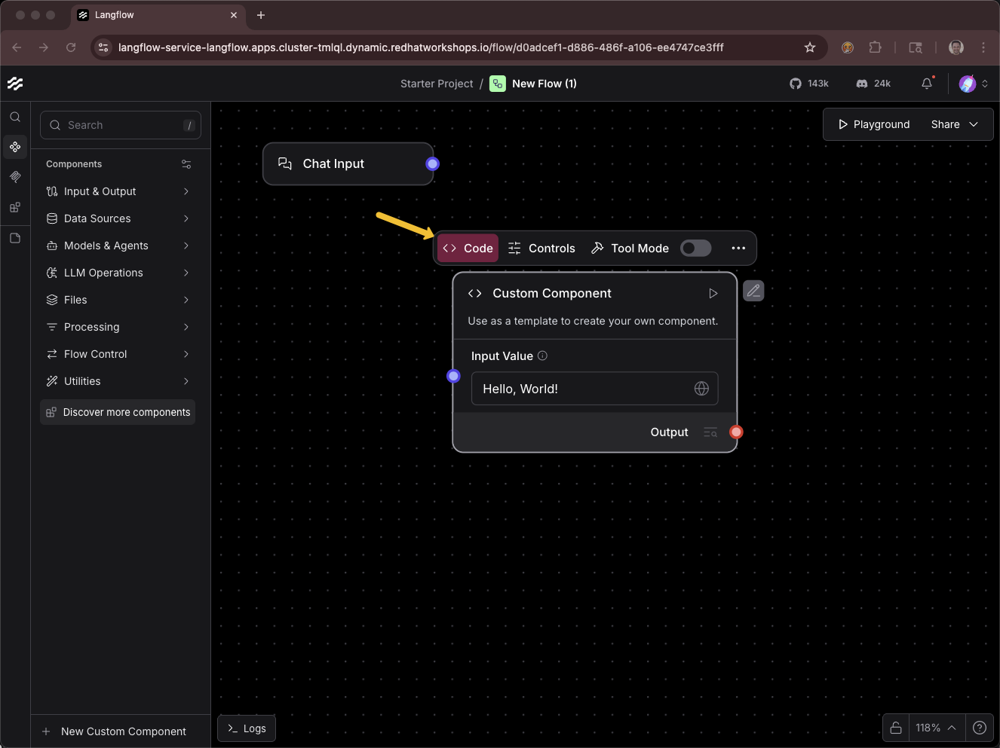

  4. Paste in *vll_model_component.py* contents

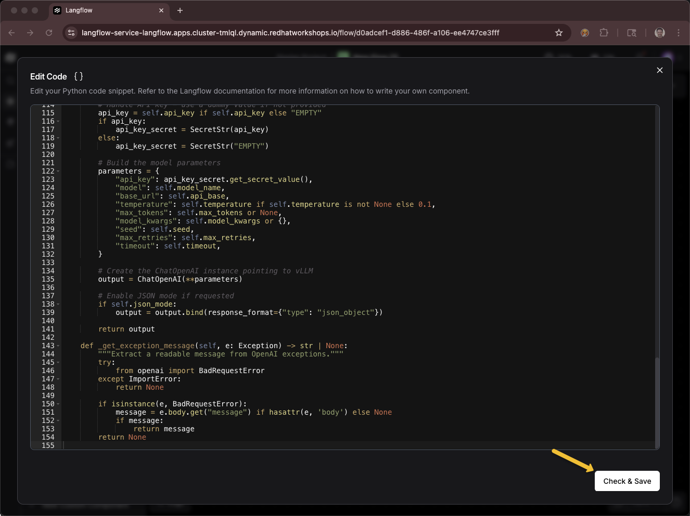

  Click *Check and Save*


vLLM API Base URL 


**https://litellm-prod.apps.maas.redhatworkshops.io/v1**


Model Name:


**qwen3-14b**


API Key from the workshop showroom


sk-ra1gvuhDVSRRLVog7szx8Q

if you need these variables later

```bash
export BASE_URL=https://litellm-prod.apps.maas.redhatworkshops.io/v1
export INFERENCE_MODEL=qwen3-14b
export API_KEY=sk-ra1gvuhDVSRRLVog7szx8Q
```

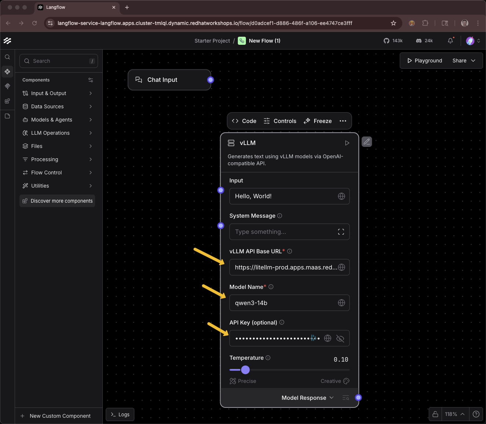


Add Chat Output component

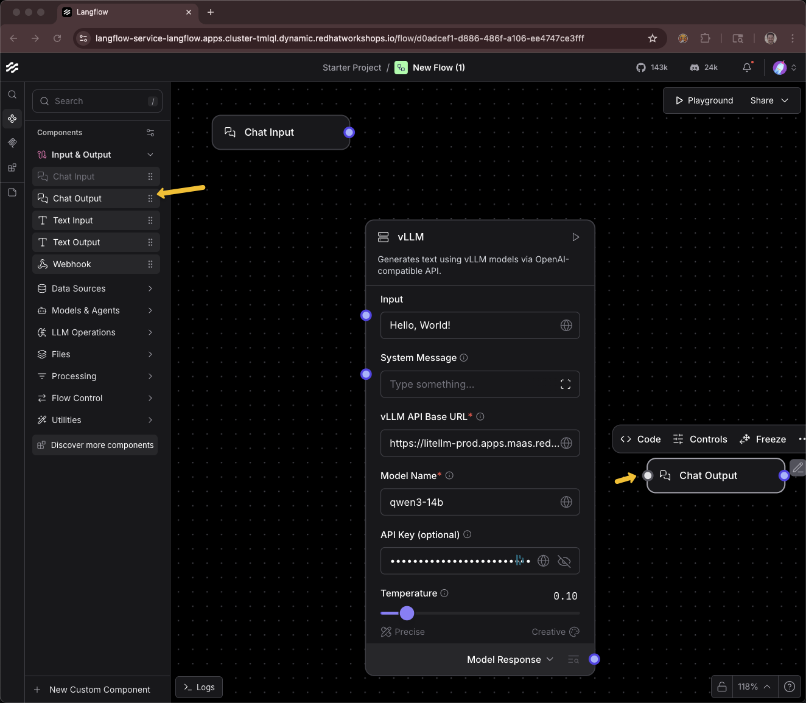


Connect: Chat Input → vLLM → Chat Output

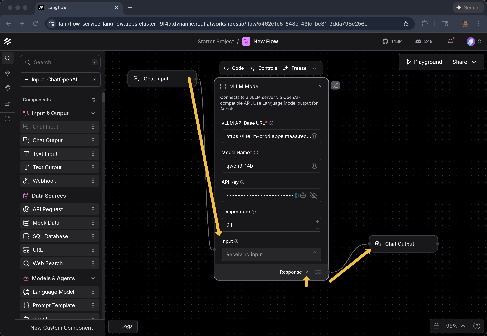

Open Playground and chat with your flow

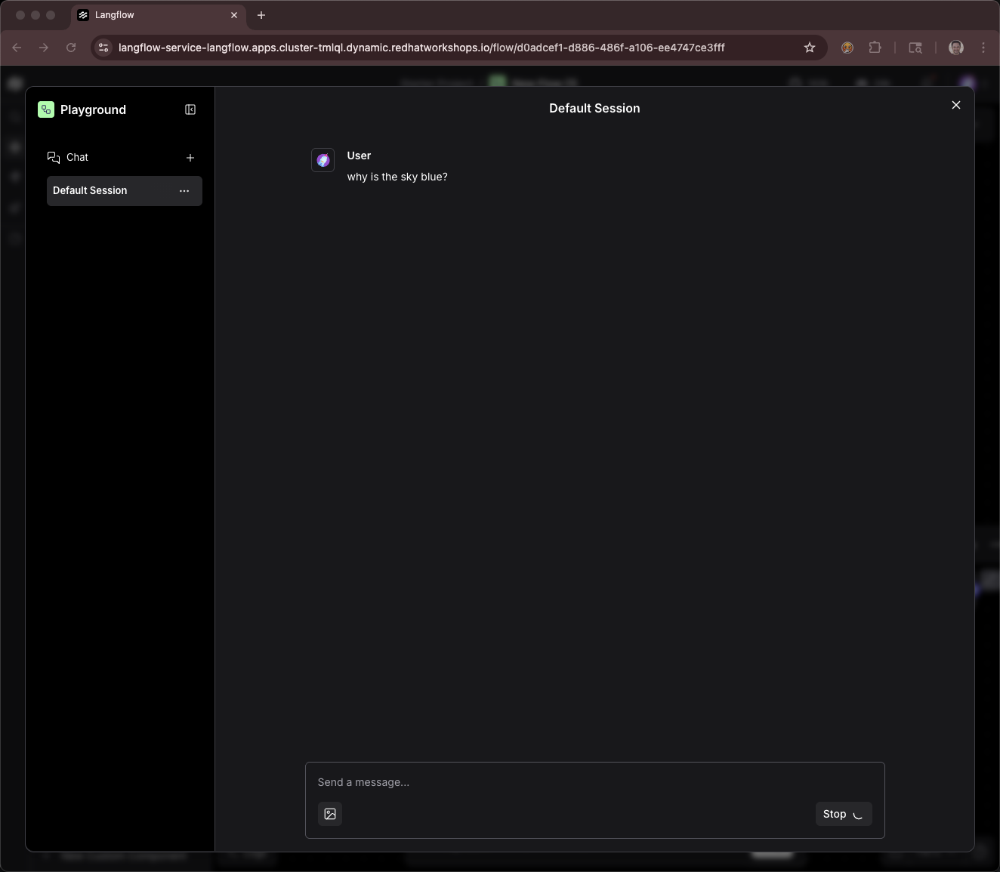

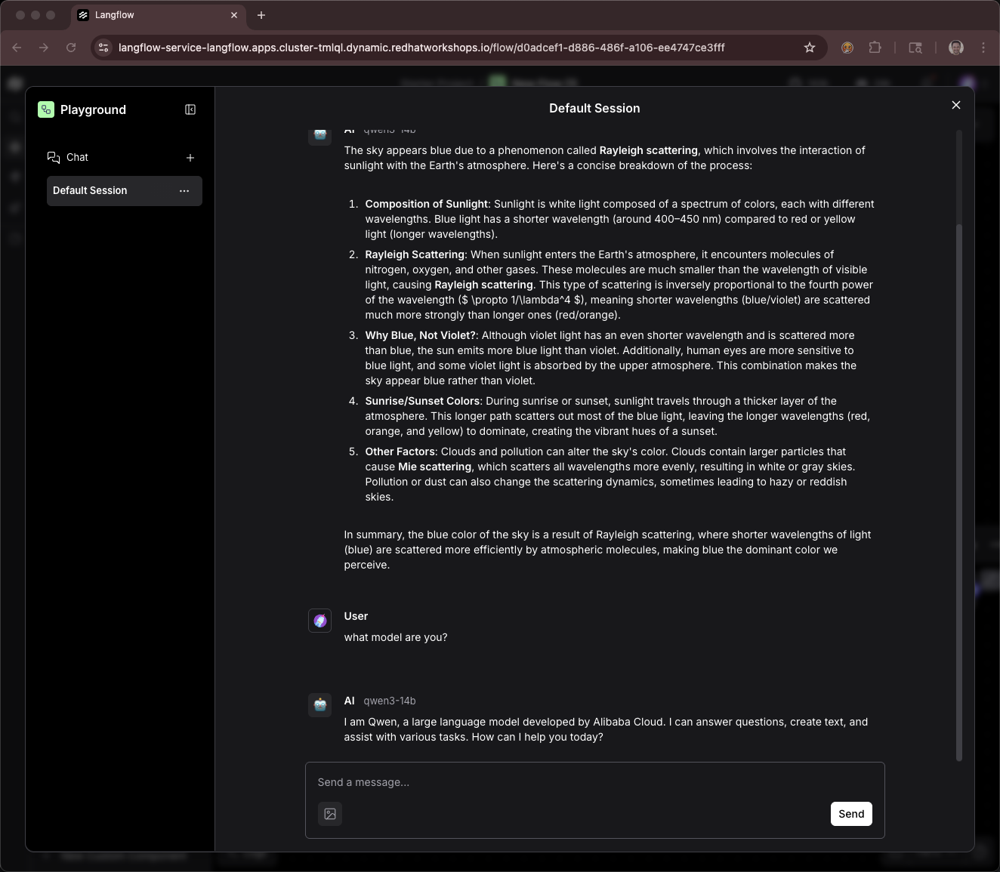


## MaaS Agent Flow

```bash
curl -s --compressed -X POST \
    "${LANGFLOW_URL}/api/v1/flows/" \
    -H "Content-Type: application/json" \
    -H "x-api-key: ${LANGFLOW_API_KEY}" \
    -d @flow_examples/maas-agent-flow.json
```

## MCP

```bash
export NAMESPACE=agentic-user1
```

```bash
export CUSTOMER_MCP_SERVER_URL=https://$(oc get routes -l app=mcp-customer -n $NAMESPACE -o jsonpath="{range .items[*]}{.status.ingress[0].host}{end}")/mcp
export FINANCE_MCP_SERVER_URL=https://$(oc get routes -l app=mcp-finance -n $NAMESPACE -o jsonpath="{range .items[*]}{.status.ingress[0].host}{end}")/mcp
echo $CUSTOMER_MCP_SERVER_URL
echo $FINANCE_MCP_SERVER_URL
```

```
https://mcp-customer-route-agentic-user5.apps.cluster-q5gsb.dynamic.redhatworkshops.io/mcp
https://mcp-finance-route-agentic-user5.apps.cluster-q5gsb.dynamic.redhatworkshops.io/mcp
```

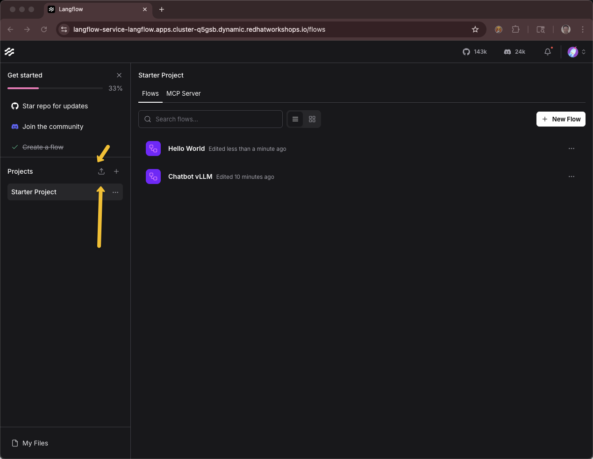

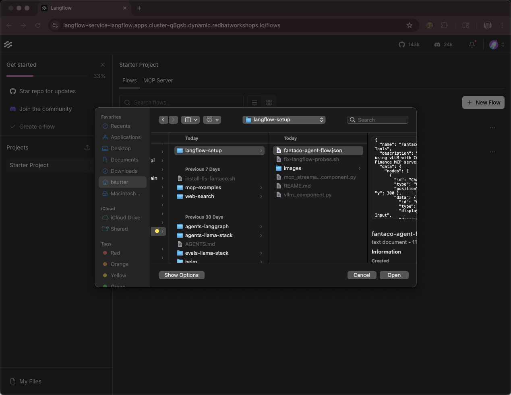


```bash
export LANGFLOW_API_KEY=sk--gPzsAUBjtLmrkNcRa19y8ADbhMklPCg_UFTDK_wRqw
export LANGFLOW_URL=https://$(oc get routes -l app=langflow-service -o jsonpath="{range .items[*]}{.status.ingress[0].host}{end}")
```


Curl based testing

```bash
export LANGFLOW_FLOW_ID=0c0c981b-be3f-426d-b4e9-ecb608ce56b3

  curl -s --compressed -X POST \
    "${LANGFLOW_URL}/api/v1/run/${LANGFLOW_FLOW_ID}" \
    -H "Content-Type: application/json" \
    -H "x-api-key: ${LANGFLOW_API_KEY}" \
    -d '{"input_type": "chat", "output_type": "chat", "input_value": "what model are you?"}' | jq '.'
```

## Langflow API

```
curl -s -X GET \
    "${LANGFLOW_URL}/api/v1/flows/?get_all=true" \
    -H "accept: application/json" \
    -H "x-api-key: ${LANGFLOW_API_KEY}" | jq '.[] | {id: .id, name: .name}'
```

## Debugging

  # Get build logs for a specific flow
  curl -s --compressed "${LANGFLOW_URL}/api/v1/monitor/builds?flow_id=YOUR_FLOW_ID" \
    -H "x-api-key: ${LANGFLOW_API_KEY}" | jq '.'

  # Get messages for a session
  curl -s --compressed "${LANGFLOW_URL}/api/v1/monitor/messages/session/YOUR_SESSION_ID" \
    -H "x-api-key: ${LANGFLOW_API_KEY}" | jq '.'

  
  curl -s -X POST "${LANGFLOW_URL}/api/v1/run/YOUR_FLOW_ID" \
    -H "Content-Type: application/json" \
    -H "x-api-key: ${LANGFLOW_API_KEY}" \
    -d '{"input_type": "chat", "output_type": "chat", "input_value": "test"}' | jq '.'


  # Set environment variables
  export LANGFLOW_URL=https://$(oc get routes -l app=langflow-service -o jsonpath="{range .items[*]}{.status.ingress[0].host}{end}")
  export LANGFLOW_API_KEY=sk-ad1SVjErw7NtrTkKBjPeaL0N4R0KYRozqW3V5d8nhfI

  # List all flows
  curl -s --compressed -X GET \
    "${LANGFLOW_URL}/api/v1/flows/?remove_example_flows=true&get_all=true" \
    -H "accept: application/json" \
    -H "x-api-key: ${LANGFLOW_API_KEY}" | jq '.[] | {id: .id, name: .name}'


# list all components
  curl -s --compressed -X GET \
    "${LANGFLOW_URL}/api/v1/store/components/" \
    -H "accept: application/json" \
    -H "x-api-key: ${LANGFLOW_API_KEY}" | jq '.results[] | {name: .name, description: .description}'

To see all components within a specific category (e.g., openai):
curl -s --compressed -X GET \
    "${LANGFLOW_URL}/api/v1/all" \
    -H "accept: application/json" \
    -H "x-api-key: ${LANGFLOW_API_KEY}" | jq '.openai | keys'    


  # Get all properties for a specific component
  # Format: .{category}.{ComponentName}
  curl -s --compressed -X GET \
    "${LANGFLOW_URL}/api/v1/all" \
    -H "accept: application/json" \
    -H "x-api-key: ${LANGFLOW_API_KEY}" | jq '.openai.OpenAIModel'

  To get just the input fields (template properties):

  curl -s --compressed -X GET \
    "${LANGFLOW_URL}/api/v1/all" \
    -H "accept: application/json" \
    -H "x-api-key: ${LANGFLOW_API_KEY}" | jq '.openai.OpenAIModel.template | keys'

  This returns:
  ["_type", "api_key", "code", "input_value", "json_mode", "max_retries",
   "max_tokens", "model_kwargs", "model_name", "openai_api_base", "seed",
   "stream", "system_message", "temperature", "timeout"]

  To see a specific field's details:

  curl -s --compressed -X GET \
    "${LANGFLOW_URL}/api/v1/all" \
    -H "accept: application/json" \
    -H "x-api-key: ${LANGFLOW_API_KEY}" | jq '.openai.OpenAIModel.template.model_name'