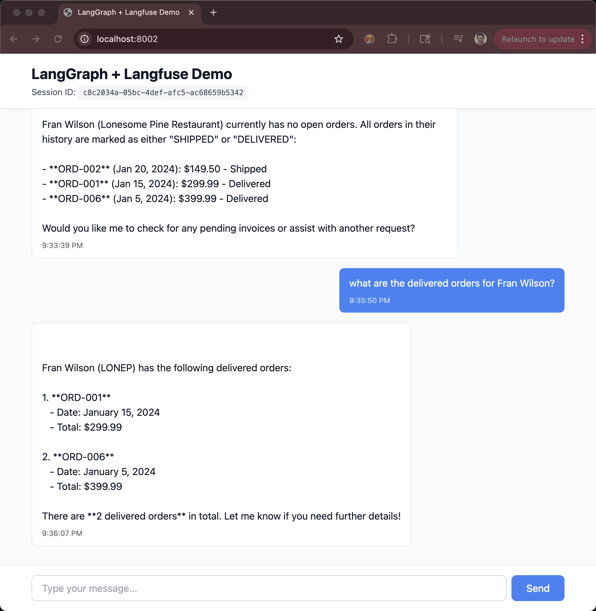
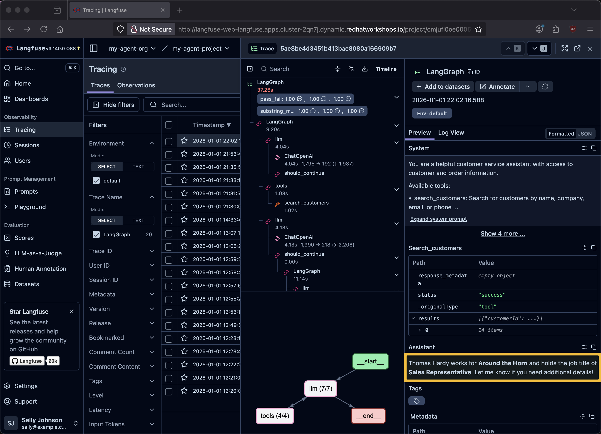

# LangGraph + Langfuse Exercise

A simple teaching exercise showing how to integrate LangGraph agents with Langfuse observability.

## Quick Start


### 1. Setup and Run

```bash
cd backend

# Create virtual environment
python3.12 -m venv .venv
source .venv/bin/activate  # On Windows: venv\Scripts\activate
```

```bash
# Install dependencies
pip install -r requirements.txt

# Create .env file
cp .env.example .env

# Edit .env and add your credentials:
# - API_KEY (your OpenAI API key or simply "not applicable")
# - LANGFUSE_PUBLIC_KEY
# - LANGFUSE_SECRET_KEY
# - LANGFUSE_HOST (default: https://cloud.langfuse.com)
```

The LANGFUSE values come from navigating the Langfuse UI (see [screenshots](../screenshots.md) for guidance)


**Note: LANGFUSE_BASE_URL is now *LANGFUSE_HOST***

```bash
# Run the server
python 6-langgraph-langfuse-fastapi-chatbot.py
```

The server will start on `http://localhost:8002` and serve both the API and web UI.


#### Test Backend

```bash
curl -X POST http://localhost:8002/chat \
  -H "Content-Type: application/json" \
  -d '{
    "message": "who does Thomas Hardy work for?",
    "user_id": "test-user",
    "session_id": "test-session-123"
}'
```

**Expected Response Format:**
```json
{
  "reply": "Thomas Hardy is a Sales Representative at Around the Horn...",
  "tool_result": null,
  "trace_id": "019b4ccc-fa59-7fa2-a56e-854d0fafbfda"
}
```

**Health Check:**
```bash
curl -s http://localhost:8002/health | python -m json.tool
```

**Root Endpoint (API Info):**
```bash
curl -s http://localhost:8002/ | python -m json.tool
```

**Chat Endpoint - Simple Query:**
```bash
curl -X POST http://localhost:8002/chat \
  -H "Content-Type: application/json" \
  -d '{"message": "Who is Thomas Hardy?", "session_id": "test-session-123", "user_id": "test-user"}'
```

**Chat Endpoint - Complex Query with Orders:**
```bash
curl -X POST http://localhost:8002/chat \
  -H "Content-Type: application/json" \
  -d "{\"message\": \"What are the orders for Thomas Hardy?\", \"session_id\": \"session-456\", \"user_id\": \"admin\"}"
```

**Chat Endpoint - Search by Company:**
```bash
curl -X POST http://localhost:8002/chat \
  -H "Content-Type: application/json" \
  -d '{"message": "Find orders for Lonesome Pine Restaurant", "session_id": "demo-session"}'
```


### Access the Application

Once the backend is running, open your browser and go to:

1. Open `http://localhost:8002` in your browser
2. Send a message like "Who is Thomas Hardy?"
3. Check your Langfuse dashboard to see the trace!
4. Click on the trace ID in Langfuse to view detailed execution




## Running Evaluations

The chatbot includes a built-in evaluation system that tests the agent against predefined questions with expected ("golden") answers. Results are scored and recorded to Langfuse.

### Run All Evaluations

```bash
curl -sS -X POST http://localhost:8002/evaluate \
  -H "Content-Type: application/json" \
  -d '{"run_name": "baseline-v1"}' | jq
```

**Response:**
```json
{
  "run_name": "baseline-v1",
  "timestamp": "2026-01-01T22:02:54.748324",
  "dataset_name": "customer-service-eval",
  "total_tests": 3,
  "passed": 3,
  "failed": 0,
  "pass_rate": 1.0,
  "average_score": 1.0,
  "duration_ms": 38272.0992565155,
  "results": [
    {
      "test_id": "thomas-hardy-company-job",
      "test_name": "Thomas Hardy Company and Job Query",
      "passed": true,
      "score": 1.0,
      "response": "\n\nThomas Hardy works for **Around the Horn** and holds the job title of **Sales Representative**. Let me know if you need additional details!",
      "trace_id": "5ae8be4d3451b413bae8080a166909b7",
      "matched_keywords": [
        "Around the Horn",
        "Sales Representative"
      ],
      "missing_keywords": [],
      "details": "Matched 2/2 keywords",
      "duration_ms": 9614.3319606781
    },
    {
      "test_id": "lonesome-pine-contact",
      "test_name": "Lonesome Pine Contact Query",
      "passed": true,
      "score": 1.0,
      "response": "\n\nThe primary contact for **Lonesome Pine Restaurant** is **Fran Wilson**, the Sales Manager. You can reach them via:\n\n- **Phone:** (503) 555-9573  \n- **Email:** franwilson@example.com  \n\nLet me know if you need further assistance! 😊",
      "trace_id": "5ae8be4d3451b413bae8080a166909b7",
      "matched_keywords": [
        "Fran Wilson",
        "(503) 555-9573",
        "franwilson@example.com"
      ],
      "missing_keywords": [],
      "details": "Matched 3/3 keywords",
      "duration_ms": 11244.790077209473
    },
    {
      "test_id": "fran-wilson-delivered-orders",
      "test_name": "Fran Wilson Delivered Orders Query",
      "passed": true,
      "score": 1.0,
      "response": "\n\nHere are the delivered orders for Fran Wilson (LONEP):\n\n1. **Order #ORD-001**  \n   - Date: January 15, 2024  \n   - Total: $299.99  \n\n2. **Order #ORD-006**  \n   - Date: January 5, 2024  \n   - Total: $399.99  \n\nThere is also one shipped order (ORD-002) from January 20, 2024, totaling $149.50. Let me know if you need further details!",
      "trace_id": "5ae8be4d3451b413bae8080a166909b7",
      "matched_keywords": [
        "ORD-001",
        "$299.99",
        "ORD-006",
        "$399.99"
      ],
      "missing_keywords": [],
      "details": "Matched 4/4 keywords",
      "duration_ms": 16612.935304641724
    }
  ]
}
```

### View Current Test Cases

```bash
curl http://localhost:8002/evaluation/test-cases
```

### Sync Dataset to Langfuse (without running tests)

```bash
curl -X POST http://localhost:8002/sync-dataset \
  -H "Content-Type: application/json" \
  -d '{}'
```

### Modifying the Evaluation Dataset

Test cases are stored in `backend/data/eval_test_cases.csv`. Edit this file to add, modify, or remove test cases.


**Field descriptions:**

| Field | Description |
|-------|-------------|
| `id` | Unique identifier for the test case |
| `name` | Human-readable name shown in results |
| `input.message` | The question sent to the chatbot |
| `expected_keywords` | List of strings that must appear in the response |
| `match_mode` | `"all"` = all keywords required, `"any"` = at least one |


### Evaluation API Options

**POST /evaluate**

| Parameter | Type | Default | Description |
|-----------|------|---------|-------------|
| `run_name` | string | auto-generated | Name for this evaluation run |
| `sync_dataset` | boolean | `true` | Sync local JSON to Langfuse before running |
| `record_to_langfuse` | boolean | `true` | Record scores to Langfuse traces |

**Example with all options:**
```bash
curl -X POST http://localhost:8002/evaluate \
  -H "Content-Type: application/json" \
  -d '{
    "run_name": "after-prompt-update",
    "sync_dataset": true,
    "record_to_langfuse": true
  }'
```

### Viewing Results in Langfuse

After running evaluations:
1. Open your Langfuse dashboard
2. Navigate to **Datasets** to see the `customer-service-eval` dataset
3. View individual traces to see `substring_match` and `pass_fail` scores
4. Compare evaluation runs over time to track agent improvements





## User Feedback

The chat UI includes thumbs up/down feedback buttons on each AI response. Users can optionally add a comment. All feedback is recorded to Langfuse as scores.

### How It Works

1. User sends a message and receives a response
2. Below each AI response, 👍 and 👎 buttons appear
3. Clicking a button opens a modal for an optional comment
4. Feedback is submitted to Langfuse and linked to the trace

### Feedback API

**Submit feedback programmatically:**
```bash
curl -X POST http://localhost:8002/feedback \
  -H "Content-Type: application/json" \
  -d '{
    "trace_id": "YOUR_TRACE_ID",
    "score": 1,
    "comment": "Very helpful response!"
  }'
```

| Parameter | Type | Description |
|-----------|------|-------------|
| `trace_id` | string | The trace ID from the chat response |
| `score` | int | `1` for thumbs up, `0` for thumbs down |
| `comment` | string | Optional user comment |

### Feedback Report

Get a report of all user feedback:

```bash
curl http://localhost:8002/feedback-report | jq
```

**Response:**
```json
{
  "total": 15,
  "positive": 12,
  "negative": 3,
  "feedback": [
    {
      "trace_id": "abc123",
      "score": "thumbs_up",
      "comment": "Very helpful!",
      "created_at": "2026-01-01T14:30:00Z"
    }
  ]
}
```

### Viewing Feedback in Langfuse

1. Open your Langfuse dashboard
2. Navigate to **Scores** in the left sidebar
3. Filter by name: `user-feedback`
4. View scores with values and comments


### Export Feedback

Export the feedback for further analysis and reporting


## Project Structure

```
.
├── backend/
│   ├── 6-langgraph-langfuse-fastapi-chatbot.py  # FastAPI app serving API + web UI
│   ├── requirements.txt                          # Python dependencies
│   ├── .env.example                              # Environment variables template
│   ├── evaluation/                               # Evaluation module
│   │   ├── __init__.py
│   │   ├── scorer.py                             # Substring matching scorer
│   │   ├── dataset.py                            # Langfuse dataset sync
│   │   └── runner.py                             # Evaluation runner
│   └── data/
│       └── eval_test_cases.csv                   # Test cases (questions + golden answers)
├── frontend/
│   └── index.html                                # Single-file vanilla JS chat interface
└── README.md                                     # This file
```

## Architecture

The application is now a **single Python process**:
- FastAPI backend handles chat requests via `/chat` endpoint
- Frontend HTML is served from root `/`
- Both run on `http://localhost:8002`
- No separate frontend server needed
- No Node.js or npm dependencies


[Video Demo](https://youtu.be/VFldGFVgUvk)


