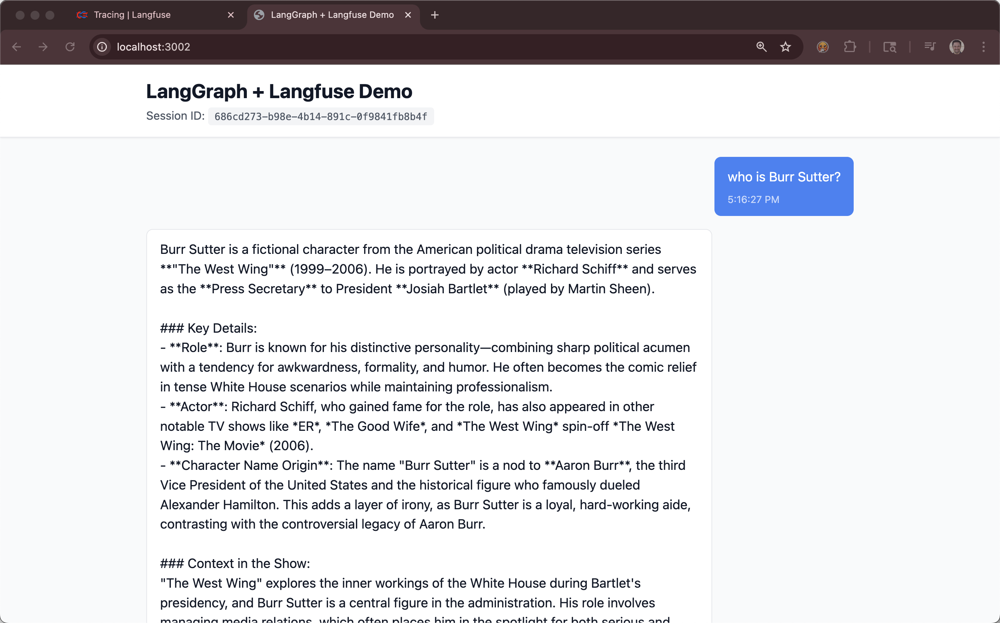
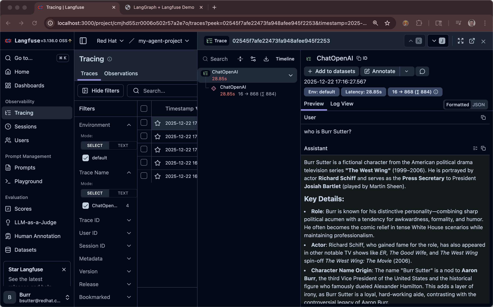

# LangGraph + Langfuse Demo

A simple teaching demo showing how to integrate LangGraph agents with Langfuse observability.

## Quick Start

### Prerequisites

- Python 3.12+
- Node.js 18+
- OpenAI API key (or vLLM endpoint)
- Langfuse account and API keys

### 1. Setup Backend

```bash
cd backend

# Create virtual environment
python3.12 -m venv .venv
source venv/bin/activate  # On Windows: venv\Scripts\activate

# Install dependencies
pip install -r requirements.txt

# Create .env file
cp .env.example .env

# Edit .env and add your credentials:
# - API_KEY (your OpenAI or vLLM API key)
# - LANGFUSE_PUBLIC_KEY
# - LANGFUSE_SECRET_KEY
# - LANGFUSE_BASE_URL (default: https://cloud.langfuse.com)

# Run the server
python main.py
```

The backend will start on `http://localhost:8002`


#### Test Backend

```bash
curl -X POST http://localhost:8002/api/v1/chat \
-H "Content-Type: application/json" \
-d '{
    "message": "Hello, how are you?",
    "user_id": "test-user",
    "session_id": "test-session-123"
}'
```

### 2. Setup Frontend

```bash
cd frontend

# Install dependencies
npm install

# Create .env file (optional - defaults to localhost:8002)
cp .env.example .env

# Run the development server
npm run dev
```

The frontend will start on `http://localhost:3002`

### 3. Test the Application

1. Open `http://localhost:3002` in your browser
2. Send a message in the chat
3. Check your Langfuse dashboard to see the trace!

## What You'll See in Langfuse

When you send messages, Langfuse will capture:

- **Traces**: Complete conversation flows with session ID and user ID
- **Spans**: Individual LLM calls with input/output messages
- **Metrics**: Token usage, latency, and costs

## Project Structure

```
.
├── backend/
│   ├── main.py              # FastAPI app with LangGraph agent
│   ├── requirements.txt     # Python dependencies
│   └── .env.example        # Environment variables template
├── frontend/
│   ├── src/
│   │   ├── App.jsx         # React chat interface
│   │   ├── main.jsx        # Entry point
│   │   └── index.css       # Tailwind styles
│   ├── index.html
│   ├── package.json
│   ├── vite.config.js
│   ├── tailwind.config.js
│   └── .env.example
├── SPEC.md                  # Full technical specification
└── README.md               # This file
```

## Chat Interface






## Learning Resources

- [SPEC.md](./SPEC.md) - Complete technical specification
- [LangGraph Docs](https://python.langchain.com/docs/langgraph)
- [Langfuse Docs](https://langfuse.com/docs)
- [FastAPI Docs](https://fastapi.tiangolo.com/)

## Next Steps

1. Add a simple tool (e.g., current time lookup)
2. Implement conversation memory
3. Explore different prompt engineering techniques
4. Analyze traces in Langfuse dashboard
